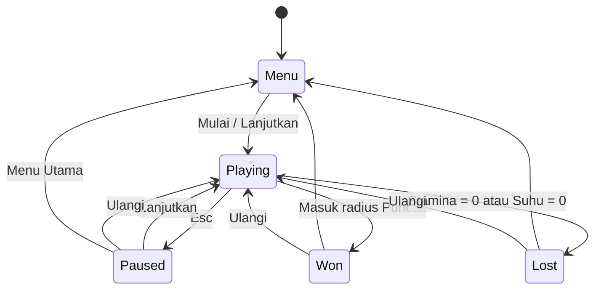
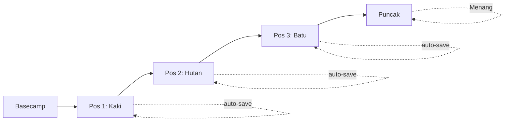

# ⛰️ PRD — Mountain Game: Pendakian 3D Offline

## 0. Informasi Dokumen

| Field | Nilai |
| :--- | :--- |
| **ID Dokumen** | PRD-MTN-001 |
| **Nama Produk** | Mountain Game — Pendakian 3D Offline |
| **Versi Dokumen** | 1.0 |
| **Tanggal** | 11 September 2026 |
| **Penulis** | Jeremy Valentin Siahaan |
| **Status** | Draft |
| **Dokumen Terkait** | `README.md`, `docs/MOUNTAIN_GDD.md`, `docs/CONTROLS.md`, `docs/GLOSSARY.md` |
| **Repo** | `mountain-game/` (pola stack mengikuti `cs-game/client`, pola GDD mengikuti `farm-game`) |

> **Catatan posisi dokumen:** PRD ini menjawab *apa yang harus ada dan mengapa* (kebutuhan produk, lingkup, kriteria sukses). Detail *bagaimana* mekanik dirancang (angka balancing, level design, narasi) tetap menjadi tanggung jawab `MOUNTAIN_GDD.md`. Detail *cara menjalankan* tetap di `README.md`.

---

## 1. Ringkasan Eksekutif

Mountain Game adalah game pendakian gunung 3D single-player yang berjalan 100% lokal/offline di browser, dibangun dengan Vite + React + Three.js + Zustand — stack yang sama dengan proyek game browser Jeremy sebelumnya ([[csgame]], [[farm-tycoon]]). Pemain mendaki dari Basecamp menuju Puncak melalui tiga pos checkpoint, sambil mengelola tiga sumber daya vital: **stamina**, **suhu tubuh**, dan **oksigen**. Fokus v1 adalah satu mode permainan (solo hiking) yang solid, ringan, dan sepenuhnya dapat dimainkan tanpa koneksi internet.

## 2. Latar Belakang & Masalah

- Jeremy membangun serangkaian game browser eksploratif ([[csgame]] — FPS, [[farm-tycoon]] — simulasi farming) sebagai sarana belajar stack web 3D modern (React Three Fiber, Zustand, TypeScript) sekaligus melatih kebiasaan audit kode yang rigor.
- Proyek-proyek sebelumnya menunjukkan pola berulang: state management dengan Zustand rentan terhadap bug logika (RNG loot yang salah, softlock akibat resource habis, sistem yang "roll" tapi tidak diterapkan — ditemukan saat audit [[farm-tycoon]]). Belum ada dokumen kebutuhan produk (PRD) formal di proyek-proyek ini yang mendefinisikan *scope* dan *acceptance criteria* sebelum implementasi — dokumentasi yang ada baru README (setup) dan rencana GDD (desain).
- **Masalah yang ingin diselesaikan dokumen ini:** belum ada satu sumber kebenaran (single source of truth) yang mendefinisikan fitur wajib v1, batasan lingkup, dan kriteria "selesai" untuk Mountain Game sebelum development lanjut — sehingga besar risiko scope creep atau fitur setengah jadi seperti yang pernah ditemukan di audit proyek sebelumnya.

## 3. Tujuan Produk (Goals)

| ID | Tujuan | Ukuran Keberhasilan |
| :--- | :--- | :--- |
| G1 | Menyediakan satu game loop pendakian yang bisa dimainkan dari awal (Basecamp) sampai akhir (Puncak/Evakuasi) tanpa bug blocking | 0 softlock/dead-end pada 10x playtest berturut-turut |
| G2 | Menjamin pengalaman 100% offline setelah instalasi | 0 network request ke luar (CDN/font/API) terverifikasi di DevTools Network tab |
| G3 | Menjaga performa 3D tetap ringan di perangkat menengah | ≥ 45 FPS rata-rata di laptop kelas menengah (integrated GPU) |
| G4 | Menjaga konsistensi arsitektur dengan proyek game Jeremy sebelumnya agar mudah dipelihara | Struktur state (Zustand + persist), struktur folder `src/game/`, dan pola HUD/menu selaras dengan [[csgame]] & [[farm-tycoon]] |
| G5 | Menyediakan kurva kesulitan yang terasa "adil" — menang butuh usaha, kalah terasa masuk akal | Rata-rata 1–2 kali gagal (evakuasi) sebelum berhasil mencapai puncak pada playtest pertama |

## 4. Target Pengguna

| Persona | Deskripsi | Kebutuhan Utama |
| :--- | :--- | :--- |
| **Solo Player (Jeremy sendiri & lingkar terdekat)** | Pemain yang ingin sesi santai 10–20 menit di sela waktu luang, tanpa install apapun selain `npm install` sekali | Game ringan, jelas tujuannya, bisa dilanjutkan dari save terakhir |
| **Developer/Reviewer (Jeremy sebagai QA)** | Berperan ganda sebagai pembuat dan auditor — butuh checklist requirement yang jelas untuk diverifikasi | Acceptance criteria eksplisit per fitur, kondisi menang/kalah yang deterministik dan mudah ditest |

*Catatan: karena ini proyek personal/eksplorasi (bukan produk komersial), tidak ada persona pasar eksternal atau kebutuhan monetisasi di v1.*

## 5. Lingkup Produk (Scope)

### 5.1 Dalam Lingkup — v1

- Satu mode permainan: **Pendakian Offline** (solo hiking, Basecamp → Pos 1 → Pos 2 → Pos 3 → Puncak).
- Tiga stat survival: stamina, suhu, oksigen — dengan efek naik dari item dan penurunan alami seiring waktu/aktivitas.
- Sistem checkpoint dengan auto-save ke `localStorage` (key `mountain-game-storage`).
- Sistem loot & inventory sederhana (4 jenis item: Bekal, Jaket hangat, P3K, Oksigen).
- Kondisi menang (mencapai radius puncak) dan kalah (stamina/suhu = 0 → layar evakuasi).
- HUD (bar stat, kompas, inventory, tombol menu tunggal).
- Menu utama, layar pause, layar menang/kalah dengan statistik dasar.
- Audio prosedural (langkah, angin, checkpoint) — tanpa file audio eksternal.
- Satu terrain low-poly prosedural (tanpa aset 3D yang di-download).

### 5.2 Di Luar Lingkup — v1 (kandidat versi mendatang)

- Multiplayer / mode co-op pendakian.
- Cuaca dinamis kompleks (badai, kabut) yang memengaruhi visibility.
- Sistem waktu siang-malam yang memengaruhi gameplay secara mendalam.
- Kontrol sentuh/mobile.
- Lebih dari satu gunung/level.
- Sistem crafting atau upgrade equipment.
- Leaderboard online, achievement, atau telemetry/analytics apa pun (bertentangan dengan prinsip 100% offline).
- Monetisasi dalam bentuk apa pun.

## 6. Kebutuhan Fungsional (Functional Requirements)

### 6.1 Pergerakan & Kontrol Pemain

| ID | Requirement |
| :--- | :--- |
| FR-1.1 | Pemain dapat bergerak relatif arah kamera menggunakan WASD atau tombol panah. |
| FR-1.2 | Kamera dapat diputar mengelilingi karakter dengan mouse setelah pointer-lock diaktifkan (klik kanvas). |
| FR-1.3 | Menahan Shift mengaktifkan sprint dengan konsumsi stamina 2x lipat dari laju normal. |
| FR-1.4 | Spasi memicu lompatan kecil (tidak menguras stamina secara signifikan — nilai diusulkan, dapat di-tuning). |
| FR-1.5 | Tombol E memicu interaksi kontekstual: mendirikan tenda (checkpoint/save) saat berada dalam radius pos. |
| FR-1.6 | Esc membuka menu pause berisi Lanjutkan, Ulangi, dan Menu Utama. |

### 6.2 Sistem Survival Stats

| ID | Requirement |
| :--- | :--- |
| FR-2.1 | Sistem melacak tiga stat: **Stamina** (0–100), **Suhu** (0–100), **Oksigen** (0–100, aktif mulai Pos 3 ke atas). |
| FR-2.2 | Stamina berkurang secara pasif saat bergerak, dan 2x lebih cepat saat sprint (lihat FR-1.3). *(Nilai laju drain default diusulkan: 1 poin/detik jalan normal — perlu playtesting untuk finalisasi.)* |
| FR-2.3 | Suhu berkurang seiring ketinggian/posisi pemain semakin dekat puncak *(diusulkan: laju drain meningkat setiap melewati pos berikutnya)*. |
| FR-2.4 | Oksigen mulai berkurang hanya setelah pemain melewati Pos 3 (zona ketinggian tinggi). |
| FR-2.5 | Setiap stat mencapai 0 (stamina **atau** suhu) memicu kondisi kalah (evakuasi). Oksigen 0 juga harus didefinisikan pemicu kalah atau efek merugikan — **perlu klarifikasi, lihat Open Questions §17**. |
| FR-2.6 | HUD menampilkan ketiga bar stat secara real-time dan berubah warna/peringatan saat mendekati kritis (diusulkan: ≤20%). |

### 6.3 Sistem Item & Inventory

| ID | Requirement | Efek |
| :--- | :--- | :--- |
| FR-3.1 | 🍙 Bekal dapat diambil otomatis saat pemain mendekat, digunakan via HUD atau tombol `1` | +30 stamina |
| FR-3.2 | 🧥 Jaket hangat, loot khusus Pos 2, tombol `2` | +30 suhu |
| FR-3.3 | 🩹 P3K, loot Pos 1/3, tombol `3` | +40 suhu & stamina |
| FR-3.4 | 🫁 Oksigen, loot Pos 3 ke atas, tombol `4` | +50 oksigen |
| FR-3.5 | Item hilang dari dunia setelah diambil (tidak respawn dalam satu sesi permainan). |
| FR-3.6 | Posisi seluruh pos dan loot berasal dari satu sumber data (`terrain.ts`), mengikuti pola `survivalLayout.ts` di [[csgame]]. |

### 6.4 Sistem Checkpoint & Save

| ID | Requirement |
| :--- | :--- |
| FR-4.1 | Memasuki radius Pos 1/2/3/Puncak meng-unlock checkpoint tersebut secara otomatis. |
| FR-4.2 | Checkpoint yang ter-unlock memicu auto-save ke `localStorage`. |
| FR-4.3 | Menu utama menyediakan opsi "Lanjutkan" yang memuat progres dari save terakhir. |
| FR-4.4 | Menu menyediakan opsi "Reset Save" yang menghapus data `mountain-game-storage`. |
| FR-4.5 | Mendirikan tenda (tombol E) di dalam pos berfungsi sebagai titik save manual tambahan. |

### 6.5 Kondisi Menang & Kalah

| ID | Requirement |
| :--- | :--- |
| FR-5.1 | Pemain menang saat memasuki radius Puncak → tampil layar `won` dengan statistik ringkasan (waktu tempuh, item terpakai, dsb — detail lihat GDD). |
| FR-5.2 | Pemain kalah (evakuasi) saat stamina atau suhu mencapai 0 → tampil layar `lost` dengan opsi Ulangi/Menu. |
| FR-5.3 | Baik layar menang maupun kalah harus menyediakan jalan kembali yang jelas (bukan dead-end UI). |

### 6.6 HUD, Menu, dan Navigasi Layar

| ID | Requirement |
| :--- | :--- |
| FR-6.1 | HUD hanya menampilkan satu tombol navigasi global: **MENU [ESC]** — tidak ada tombol duplikat untuk pause/restart di HUD (konsisten dengan aturan [[csgame]]). |
| FR-6.2 | Aplikasi memiliki 4 state layar: `menu`, `playing`, `paused`, `won`/`lost`, sesuai tabel rute di README. |
| FR-6.3 | Menu utama menyediakan: Mulai, Lanjutkan (jika ada save), Reset, dan Cara Main. |

### 6.7 Audio

| ID | Requirement |
| :--- | :--- |
| FR-7.1 | Seluruh audio (langkah, angin, checkpoint) dihasilkan secara prosedural via Web Audio API — tidak ada file audio eksternal yang di-load. |
| FR-7.2 | Audio harus dapat di-mute/atur volume dari menu pause atau menu utama (untuk memenuhi kebutuhan dasar UX; jika belum ada di README, tandai sebagai gap — lihat §17). |

## 7. User Stories

| ID | As a... | I want... | So that... | Prioritas |
| :--- | :--- | :--- | :--- | :--- |
| US-1 | Pemain | mendaki dari basecamp menuju puncak melalui checkpoint bertahap | progres saya terasa jelas dan bisa diukur | Must |
| US-2 | Pemain | mengelola stamina, suhu, dan oksigen | ada tantangan strategi, bukan sekadar jalan lurus | Must |
| US-3 | Pemain | mengambil dan memakai item survival | saya punya cara memulihkan diri saat stat kritis | Must |
| US-4 | Pemain | progres saya tersimpan otomatis di checkpoint | saya tidak perlu mengulang dari awal tiap sesi | Must |
| US-5 | Pemain | melihat layar ringkas saat menang/kalah | saya tahu hasil pendakian saya dan bisa mencoba lagi | Should |
| US-6 | Pemain | memainkan game ini tanpa koneksi internet | saya bisa main kapan pun tanpa bergantung server/CDN | Must |
| US-7 | Developer/QA (Jeremy) | tiap fitur punya kriteria penerimaan eksplisit | saya bisa memverifikasi build sebelum menganggap fitur "selesai" | Must |

## 8. Alur Pengguna (Game Flow)

Alur inti dalam sesi `Playing`:

## 9. Kebutuhan Non-Fungsional (NFR)

| ID | Kategori | Requirement |
| :--- | :--- | :--- |
| NFR-1 | Performa | Target ≥45 FPS pada perangkat kelas menengah (integrated GPU); tidak boleh ada frame drop signifikan saat loot/checkpoint terpicu. |
| NFR-2 | Offline-first | Nol permintaan jaringan keluar setelah build — tanpa CDN, tanpa Google Fonts, tanpa font/aset yang di-fetch dari internet. |
| NFR-3 | Kompatibilitas Browser | Berjalan mulus di browser modern dengan dukungan WebGL (Chrome, Edge, Firefox versi terbaru). |
| NFR-4 | Integritas Data Save | Data `localStorage` tidak boleh korup/hilang antar sesi; reset save harus dapat dipulihkan tanpa efek samping ke bagian lain aplikasi. |
| NFR-5 | Ukuran Bundle | Build `dist/` tetap ringan karena tanpa aset tekstur/audio eksternal (hanya warna-vertex & synth). |
| NFR-6 | Maintainability | Struktur kode mengikuti pola modular [[csgame]]/[[farm-tycoon]] (state terpisah di `store.ts`, data posisi terpusat di `terrain.ts`) agar mudah diaudit. |
| NFR-7 | Type Safety | Seluruh kode baru harus lolos `npm run typecheck` dan `npm run lint` tanpa error sebelum dianggap selesai. |

## 10. Kebutuhan Teknis & Stack

| Bagian | Teknologi |
| :--- | :--- |
| UI | React 18, TypeScript |
| 3D | Three.js r170, React Three Fiber 8, Drei 9 |
| Fisika | Heightmap math kustom (tanpa Rapier) |
| State | Zustand 4 + persist (`localStorage`) |
| Styling | Tailwind CSS 4 via `@tailwindcss/vite` |
| Audio | Web Audio API prosedural |
| Bundler | Vite 5 |
| Runtime minimum | Node.js 18+ |

## 11. Kriteria Penerimaan / Definition of Done

Sebuah fitur dianggap **selesai** jika:

1. Perilaku sesuai FR terkait terverifikasi manual minimal 3x percobaan berurutan tanpa hasil yang tidak konsisten.
2. Tidak ada permintaan jaringan keluar terdeteksi di tab Network browser selama sesi bermain.
3. `npm run typecheck` dan `npm run lint` lulus tanpa error terkait fitur tersebut.
4. Alur simpan/lanjutkan (`localStorage`) diverifikasi bertahan setelah reload halaman.
5. Tidak ditemukan kondisi softlock (pemain terjebak tanpa jalan menang/kalah/reset) — mengacu pada pola bug yang pernah ditemukan di audit [[farm-tycoon]].
6. Kondisi menang dan kalah masing-masing dapat dipicu secara deterministik dan diverifikasi menampilkan layar yang benar.

## 12. Risiko & Mitigasi

| ID | Risiko | Dampak | Mitigasi |
| :--- | :--- | :--- | :--- |
| R-1 | Bug logika state (RNG loot salah, softlock resource habis) — pola yang sebelumnya ditemukan saat audit [[farm-tycoon]] | Tinggi | Terapkan checklist QA eksplisit (§11) sebelum fitur dianggap selesai; audit ulang sistem inventory/checkpoint secara khusus |
| R-2 | Performa Three.js menurun di perangkat low-end karena terrain prosedural | Sedang | Batasi kompleksitas mesh terrain, uji di perangkat dengan integrated GPU sebelum rilis |
| R-3 | Web Audio API terblokir oleh autoplay policy browser (perlu interaksi user pertama) | Rendah–Sedang | Inisialisasi AudioContext setelah klik pertama (mis. saat pointer-lock diaktifkan) |
| R-4 | Definisi efek Oksigen = 0 belum jelas (lihat Open Questions) sehingga implementasi bisa ambigu | Sedang | Klarifikasi & kunci requirement di FR-2.5 sebelum development stat oksigen dimulai |
| R-5 | Scope creep menambah fitur di luar §5.2 sebelum v1 stabil | Sedang | PRD ini menjadi acuan gate — perubahan lingkup harus melalui revisi dokumen ini |

## 13. Metrik Keberhasilan (Success Metrics)

- **Completion rate playtest:** ≥80% sesi playtest berhasil mencapai layar `won` atau `lost` tanpa bug blocking.
- **Waktu tempuh normal:** satu sesi pendakian penuh (Basecamp → Puncak) berdurasi kira-kira 10–20 menit pada playthrough wajar.
- **Kurva kesulitan:** rata-rata 1–2 kali evakuasi sebelum berhasil pada percobaan pertama (selaras dengan G5).
- **Stabilitas save:** 0 kejadian data save korup/hilang selama pengujian reload berulang.
- **Kepatuhan offline:** 0 request jaringan keluar terverifikasi di seluruh sesi bermain.

## 14. Asumsi & Dependensi

- Diasumsikan pemain bermain di desktop/laptop dengan mouse + keyboard (tidak ada dukungan gamepad/touch di v1).
- Bergantung pada dukungan WebGL & Pointer Lock API di browser target — tidak ada fallback untuk browser yang tidak mendukung.
- Struktur data pos & loot di `terrain.ts` diasumsikan menjadi satu-satunya sumber kebenaran untuk layout dunia (tidak ada duplikasi data di komponen lain).
- Dokumen ini mengasumsikan `MOUNTAIN_GDD.md` menjadi tempat detail numerik/balancing final — angka yang disebut di §6 dan §9 dokumen ini bersifat requirement/target minimum, bukan nilai final desain.

## 15. Roadmap Masa Depan (Pasca-v1)

Dipertimbangkan untuk versi berikutnya, tidak mengikat untuk v1:

- Mode cuaca dinamis (badai, kabut) yang memengaruhi visibilitas dan laju drain suhu.
- Siklus siang-malam yang memengaruhi kesulitan.
- Tambahan gunung/level dengan tema berbeda.
- Dukungan kontrol sentuh untuk perangkat mobile.
- Sistem achievement lokal (tanpa server, tetap offline).

## 16. Referensi & Dokumen Terkait

- `README.md` — instruksi setup, kontrol, dan struktur repo.
- `docs/MOUNTAIN_GDD.md` — desain mekanik & balancing detail (mengikuti pola GDD [[farm-tycoon]]).
- `docs/CONTROLS.md`, `docs/GLOSSARY.md` — referensi kontrol dan istilah.
- [[csgame]] — pola stack teknis & aturan UI (satu tombol menu, tanpa duplikasi kontrol).
- [[farm-tycoon]] — pola dokumentasi GDD & pelajaran audit (RNG, softlock).

## 17. Open Questions

1. **Efek Oksigen = 0** belum didefinisikan di README — apakah memicu kalah (sama seperti stamina/suhu) atau efek berbeda (mis. penalti gerak/penglihatan)? Perlu keputusan sebelum FR-2.5 & FR-2.4 diimplementasi final.
2. Apakah dibutuhkan pengaturan volume/mute audio di menu — README belum menyebutkan ini secara eksplisit (FR-7.2 masih berupa gap yang perlu dikonfirmasi).
3. Apakah nilai laju drain stamina/suhu/oksigen akan ditentukan lewat playtesting manual, atau perlu spreadsheet balancing terpisah (seperti pola audit numerik di [[farm-tycoon]])?
4. Apakah "statistik ringkasan" di layar menang (FR-5.1) perlu didefinisikan lebih detail di GDD (mis. skor, waktu, item terpakai) sebagai bagian dari v1 atau bisa menyusul?

---

## Appendix A — Hasil Audit vs Implementasi (11 Sep 2026)

> Ditambahkan oleh agen (bukan penulis PRD) dari pemeriksaan kode aktual `mauntain-game/src/`.
> Kesimpulan: sebagian besar FR terpenuhi; beberapa bagian PRD sudah basi vs kode;
> Open Questions §17 sebagian besar **sudah terjawab oleh implementasi**; ada 2 gap nyata (lint, FPS).

### A.1 Open Questions — terjawab dari kode

| OQ | Jawaban (dengan bukti) |
| :--- | :--- |
| OQ-1 (Oksigen = 0) | **Terjawab: penalti, bukan kalah.** `store.ts:tick` — oksigen 0 membuat drain stamina ×5 (`if (oks <= 0) drain *= 5`). FR-2.5 perlu direvisi: hanya stamina/suhu = 0 yang memicu evakuasi. |
| OQ-2 (mute) | **Terjawab: sudah ada.** Toggle mute di HUD (`HUD.tsx`, tombol 🔊/🔇, persist via `muted` di store). Yang belum ada hanya slider volume — FR-7.2 terpenuhi sebagian (mute ya, volume belum). |
| OQ-3 (balancing) | **Terbuka.** Laju drain ada di `store.ts:tick` (stamina 1.2/2.5 per detik, dingin 0.4/s dengan pengali cuaca/malam/ketinggian) tetapi belum ada artefak spreadsheet/audit numerik. |
| OQ-4 (statistik menang) | **Terjawab sebagian.** Layar akhir menampilkan waktu, pos terakhir, sisa ketiga stat, dan jumlah edelweiss (`HUD.tsx` blok won/lost). "Item terpakai" belum dilacak — kandidat tambahan kecil. |

### A.2 Bagian PRD yang sudah basi vs kode (perlu revisi PRD v1.1)

- **§5.2 & §15**: cuaca dinamis (cerah/kabut/hujan/badai, `weatherTimer` 40 dtk) dan siklus siang/malam (240 dtk, memengaruhi drain suhu & pencahayaan) **sudah terimplementasi** (`store.ts`, `MountainScene.tsx:SkyRig`) — tidak lagi "di luar lingkup".
- **§5.1 & §8**: jalur tidak lagi lurus — sudah ada **jalur zigzag 19 waypoint + 2 pintasan + minimap + papan rambu** (`terrain.ts:TRAIL`, `HUD.tsx:Minimap`).
- **FR-1.5**: tombol E juga memetik **edelweiss** kolektibel (12 titik zona salju), bukan hanya tenda.
- **FR-2.1/FR-2.4**: oksigen berbasis **ketinggian** (>35 m menipis, >50 m cepat), bukan "mulai Pos 3".
- **§5.1**: hewan (burung + rusa), sungai + jembatan, zona salju, padang bunga/edelweiss, matahari/bulan, awan, bayangan PBR sudah ada — PRD v1.1 perlu memutuskan apakah ini scope resmi atau dipangkas.

### A.3 Gap nyata yang harus ditutup

1. **NFR-7 / DoD-3 (lint): demostrado gagal.** `package.json` mendefinisikan `npm run lint` (`eslint src --ext .ts,.tsx`) tetapi `eslint` **tidak terinstal** dan tidak ada config — perintah gagal total, bukan sekadar warning. Status: **diperbaiki saat audit** (instal eslint + config flat + sesuaikan script). Detail di commit audit.
2. **G3/NFR-1 (≥45 FPS): belum terukur.** Tidak ada harness pengukuran; klaim performa belum bisa dinyatakan lulus. Rekomendasi: ukur manual via overlay FPS devtools atau tambah counter FPS dev-only.
3. **FR-2.6 (peringatan ≤20%): belum ada.** Bar berubah warna di ambang 30 (`stamina/suhu > 30`), tetapi tidak ada peringatan eksplisit (ikon kedip/pesan) saat stat ≤20%.
4. **DoD-1/5/6, G1, G5, §13: butuh playtest manusia.** Tidak dapat diverifikasi oleh agen — checklist diserahkan ke Jeremy sebagai QA.

### A.4 Update gameplay (11 Sep 2026, sesi lanjutan)

- **FR-2.6 DITUTUP.** Bar berdenyut + ⚠️ saat stat ≤ 20 + pesan sekali per stat (reset saat pulih > 30) — `HUD.tsx`.
- **OQ-4 DITUTUP.** Jumlah item terpakai dilacak (`itemsUsed`, persist) dan tampil di layar akhir; peringkat finish S/A/B dari waktu + edelweiss — `store.ts`, `HUD.tsx`.
- **Scope baru di luar PRD v1.0** (perlu keputusan PRD v1.1 seperti §A.2): bahaya **batu jatuh** saat badai di zona 25–58 mdpl (`Rockfall.tsx`, damage via `takeHit`), banner peringatan, SFX benturan (`audio.ts:playRock`).
